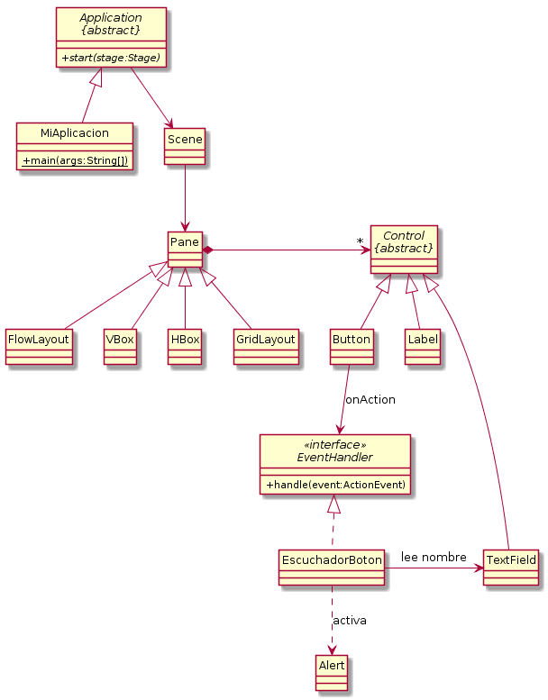

# Ejemplo de JavaFX

Si bien la librería JavaFX posee innumerables clases y métodos que 
sólo se pueden conocer a base de leer documentación, con los conocimientos
de la asignatura que poseéis a estas alturas del curso os será fácil
entenderlos, así como el diagrama de clases de una aplicación JavaFX
cualquiera.

