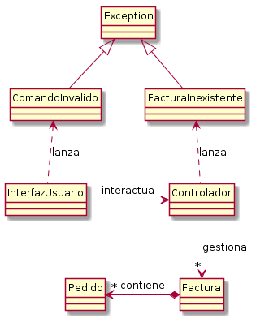

# Ejemplo de Excepciones: gestión de pedidos



Ejemplo de ejecución:

```
Comando: pedido
ID Factura? 12345
Cantidad? 4
Descripción? Servilletas
La factura con ID '12345' no existe.
Deseas crearla y añadir el pedido? [s/n] s
Factura añadida con éxito
Comando: mostrar
ID? 12345
Datos de la factura '12345':
 - 4 x Servilletas

Comando: pedido
ID Factura? 12345
Cantidad? 5
Descripción? Coca colas
Factura añadida con éxito
Comando: pedido
ID Factura? 4321
Cantidad? 1
Descripción? Palillos dientes
La factura con ID '4321' no existe.
Deseas crearla y añadir el pedido? [s/n] s
Factura añadida con éxito
Comando: mostrar
ID? 12345
Datos de la factura '12345':
 - 4 x Servilletas
 - 5 x Coca colas

Comando: mostrar
ID? 4321
Datos de la factura '4321':
 - 1 x Palillos dientes

Comando: mostrar
ID? 7890
Factura no existe: 7890
Comando: salir
```