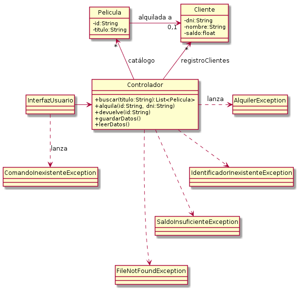

# Ejemplo Excepciones y E/S: Videoclub

El siguiente UML muestra un programa sencillo que gestiona un videoclub:



El programa permite buscar películas y alquilarlas a usuarios según el siguiente
ejemplo de ejecución:

```
comando: hola
ERROR: comando inexistente! Escribe 'ayuda' para lista de comandos
comando: ayuda
Comandos:
=========
- buscar: busca una película
- alquilar: alquila una película
- devolver: devuelve una película
- salir: finalizar el programa
comando: buscar
titulo? poli
-- Películas encontradas
3456: Vamos de polis
6664: Los superpolis
comando: alquilar
Identificador de película? 6664
DNI cliente? 33333333G
ERROR: el saldo del cliente Maria Martinez es insuficiente (1.0)
Deseas añadir 10€? [S/N] S
comando: alquilar
Identificador de película? 6664
DNI cliente? 33333333G
comando: buscar
titulo? polis
-- Películas encontradas
3456: Vamos de polis
6664: Los superpolis (alquilada a Maria Martinez(dni: 33333333G))
comando: salir
```

Además, el programa lee y guarda los datos en disco, concretamente en los ficheros `clientes.txt`
y `peliculas.txt`.

Observad que los cambios que se hagan en una ejecución del programa (alquileres, devoluciones,
cambios de saldo...) seguirán ahí en la siguiente ejecución.