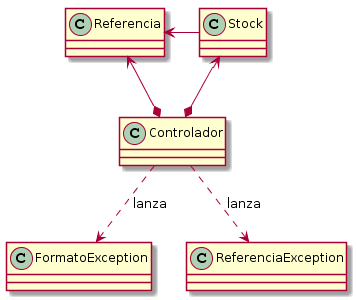

# Inventario de bar

El objetivo de este ejercicio es practicar tanto entrada y salida como
lanzamiento de excepciones.

Tenemos un  controlador que gestiona el stock de referencias de un bar.

* Una referencia está formada por un identificador y una descripción de un
  producto.
* Un _stock_ muestra, para una referencia dada, cuántas unidades hay, así 
  como el precio de cada unidad.



Las referencias y stocks se cargan en un archivo con el siguiente formato:

```
Referencias
12345:Coca Cola
53221:Estrella Damm
34983:Doritos
Stocks
12345:100:160
53221:50:210
```

En la primera parte del archivo, debajo de la línea `Referencias`, se muestran los datos
de una referencia, separados por `:`, según el formato `<identificador>:<descripción>`.

En la segunda parte del archivo, debajo de la línea `Stocks`, se muestran los datos de
un stock, según el formato `<identificador_referencia>:<cantidad>:<precio>`.

En este ejemplo, la clase `Controlador` tiene un método `carga()`, que cargará los datos del fichero
para crear los objetos  `Referencia` y `Stock` pertinentes. Además, deberá controlar que los datos
del archivo sean correctos, lanzando excepciones en los siguientes casos:

* Lanzará `ReferenciaException`
    - Cuando un identificador de referencia del apartado `Referencias` esté duplicada.
    - Cuando un identificador del apartado `Stocks` no esté registrado en la sección `Referencias`.
* Lanzará `FormatoException`
    - Cuando el archivo no esté en el formato arriba mencionado.
    - Cuando las referencias no tengan 2 campos.
    - Cuando los stocks no tengan 3 campos.
    - Cuando allá donde debe ir un entero (precio y cantidad), haya otro tipo de cadena.
    
También se muestra, para el método `main`, cómo cazar diferentes excepciones y tratarlas por
separado.