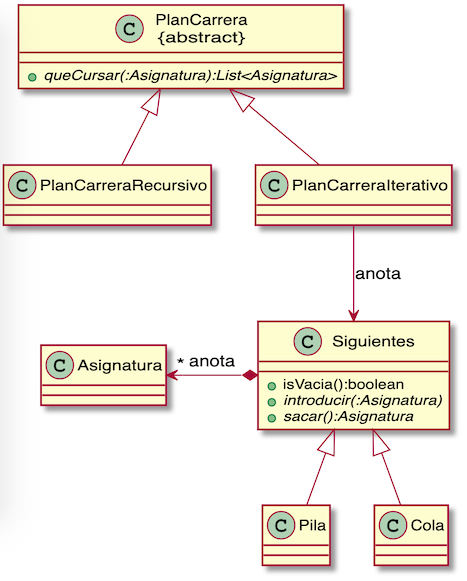

# Ejemplo de recorrido de grafos: requerimientos de asignaturas

Queremos formar un sistema que indique a un alumno que quiere estudiar una asignatura
en concreto, qué otras asignaturas debe haber cursado, según un grafo como el siguiente:

Por ejemplo, para cursar Arquitectura de Computadores primero habría que haber cursado:

* Microprocesadores
* Electrónica
* FO

Este programa de ejemplo muestra las diferentes maneras de recorrer un grafo a partir de
la asignatura que se quiere cursar:

* Búsqueda en Profundidad, _Depth First Search (DFS)_
* Búsqueda en Amplitud, _Breadth First Search (BFS)_
* Búsqueda en Profundidad de manera recursiva

A continuación se muestra el diagrama de clases de la solución aportada:

